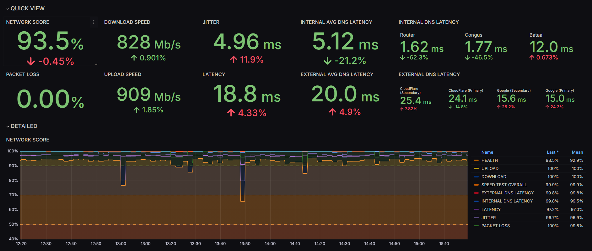
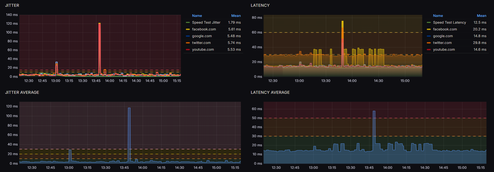
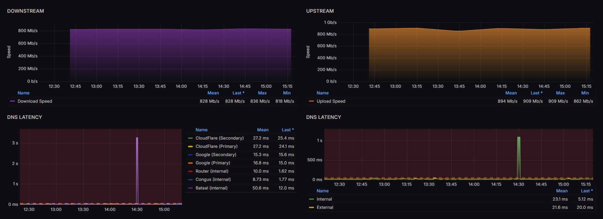
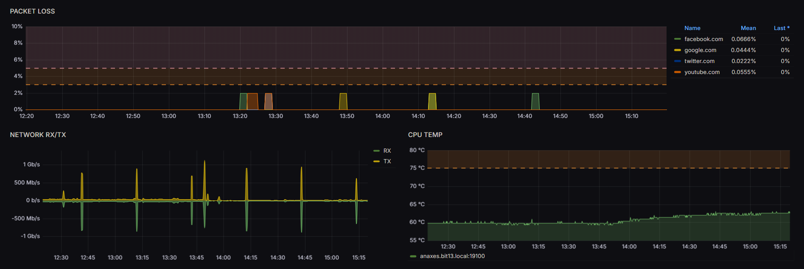
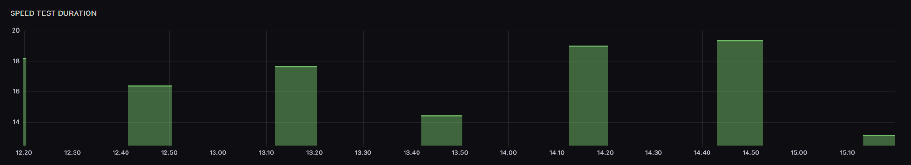

# Netprobe

Simple and effective tool for measuring ISP performance at home. The tool measures several performance metrics
including packet loss, latency, jitter, and DNS performance. It also has an optional speed test to measure bandwidth.
Netprobe aggregates these metrics into a common score, which you can use to monitor overall health of your internet
connection.

> [!NOTE]
> This is a [fork of Netprobe_lite](https://github.com/plaintextpackets/netprobe_lite). I did some refactoring of
> how the container is built, how the variables are set, the names of the variables, a lot of refactoring
> to pass lint tests, and other things.

## Support the Project

If you'd like to support the development of this project, feel free to
[buy me a coffee](https://buymeacoffee.com/plaintextpm)!

## Full Tutorial

Visit [YouTube](https://youtu.be/Wn31husi6tc) for a full tutorial on how to install and use Netprobe:

## Requirements and Setup

To run Netprobe, you'll need a PC running Docker connected directly to your ISP router. Specifically:

1. Netprobe requires the latest version of Docker. For instructions on installing Docker, see YouTube, it's super easy.

1. Netprobe should be installed on a machine (the 'probe') which has a wired Ethernet connection to your primary ISP
router. This ensures the tests are accurately measuring your ISP performance and excluding and interference from your
home network. An old PC with Linux installed is a great option for this.

### Datastore

The collection of the metrics is stored in a Datastore to cache for use. There are multiple datastores available:

- `NONE`: No cache
- `FILE`: Stores cache in a local (or mounted) volume.
- `REDIS`: Stores cache in Redis
- `MONGODB`: Stores cache in MongoDB database collection.
- `MQTT`: Stores cache in MQTT Broker.
- `HTTP`: Performs a `GET` to retrieve, and a `POST` to save the data

### Environment Variables

Todo: describe a good way to define all the environment variables

> [!NOTE]
> The order of importance for configuration values is as follows:
>
> 1. Environment Variable Value
> 1. Configuration File Value
> 1. Default Value

### Configuration via file

A configuration file can be used. The default location is `/app/config/netprobe.yaml`.

See [sample.netprobe.yaml](sample.netprobe.yaml) file for example configuration.

`NP_CONFIG_FILE` environment variable can be set to change the path of the configuration file.

> [!NOTE]
> The order of importance for configuration values is as follows:
>
> 1. Environment Variable Value
> 1. Configuration File Value
> 1. Default Value

## Installation

## How to use

1. Navigate to: `http://x.x.x.x:3001/d/app/netprobe` where x.x.x.x = IP of the probe machine running Docker.

1. Default user / pass is 'admin/admin'. Login to Grafana and set a custom password.

## How to customize

### Enable Speedtest

By default the speed test feature is disabled as many users pay for bandwidth usage (e.g. cellular connections). To
enable it, edit the .env file to set the option to 'True':

``` shell
NP_SPEEDTEST_ENABLED="True"
```

Note: speedtest.net has a limit on how frequently you can connection and run the test. If you set the test to run too
frequently, you will receive errors. Recommend leaving the `NP_SPEEEDTEST_INTERVAL` unchanged.

### Customize DNS test

If the DNS server your network uses is not already monitored, you can add your DNS server IP for testing.

To do so, modify this line in .env:

``` shell
NP_DNS_NAMESERVER_4_IP="8.8.8.8" # Replace this IP with the DNS server you use at home
```

Change 8.8.8.8 to the IP of the DNS server you use, then restart the application
(docker compose down / docker compose up)

## CALCULATIONS

###

> [!NOTE]
> The coefficient of variation (CV) is a statistic that compares the standard deviation of a data set
> to its mean. It's calculated by dividing the standard deviation by the mean, and is often expressed
> as a percentage. The CV is used to compare data sets that have different units or means.

``` math
  cv\_loss=\frac{\langle loss \rangle}{loss\_threshold}
```

``` math
  cv\_jitter=\frac{\langle jitter \rangle}{jitter\_threshold}
```

``` math
  cv\_latency=\frac{\langle latency \rangle}{latency\_threshold}
```

``` math
  cv\_internal\_dns\_latency=\frac{\langle internal\_dns\_latency \rangle}{internal\_dns\_latency\_threshold}
```

``` math
  cv\_external\_dns\_latency=\frac{\langle external\_dns\_latency \rangle}{external\_dns\_latency\_threshold}
```

``` math
  cv\_download=\frac{download}{download\_threshold}
```

``` math
  cv\_upload=\frac{upload}{upload\_threshold}

```

---

Final Score:

``` math
  overall\_score=\left(1-weight_loss \times cv_loss\right)-\left(weight_jitter \times cv_jitter\right)
    - \left(weight_latency \times cv_latency\right)
    - \left(weight_internal_dns_latency \times cv_internal_dns_latency\right)
    - \left(weight_external_dns_latency \times cv_external_dns_latency\right)
    - \left(weight_speedtest_download \times cv_download\right)
    - \left(weight_speedtest_upload \times cv_upload\right)
```

## DASHBOARD

The [dashboards](dashboards) path contains both a dashboard that makes use of the speed test in
netprobe_lite and using speedtest exporter.







## License

This project is released under a custom license that restricts commercial use. You are free to use, modify,
and distribute the software for non-commercial purposes. Commercial use of this software is strictly prohibited
without prior permission. If you have any questions or wish to use this software commercially, please contact
[plaintextpackets@gmail.com](mailto:plaintextpackets@gmail.com).
